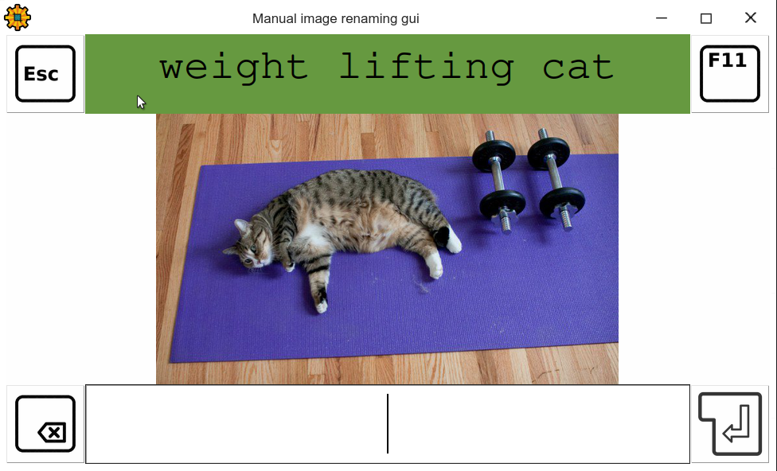

This project was originally located at [gitlab](https://gitlab.com/christianbrinkmann/image-rename-manual-gui). The project was originally only intended to rename images, but with the inclusion of animated gifs and then videos i decided that in theory this script should be able to rename all files. Because of this shift i've decided to redo the entire project and give it a new name, logo, purpose and repository.

# Crystal File Batch Renamer

The **Crystal** *file* **batch** *renamer*, or short just **crystalbatch**, is a simple *GUI* based program that allows a person to efficiently rename large batches of files manually.

## Table of contents

- [Crystal File Batch Renamer](#crystal-file-batch-renamer)
  - [Table of contents](#table-of-contents)
  - [Purpose](#purpose)
    - [Supported file types:](#supported-file-types)
  - [Requirements](#requirements)
    - [Gstreamer](#gstreamer)
    - [Python](#python)
  - [Execution](#execution)
    - [Examples](#examples)
  - [Usuage](#usuage)
    - [Key bindings](#key-bindings)
  - [How it looks like](#how-it-looks-like)
  - [TODO](#todo)
  - [Perhaps:](#perhaps)

## Purpose

This simple script displays a GUI which shows an image or video at a time with it's current title at the top. It's designed to allow for quick and comfortable manual renaming of media files.

### Supported file types:

*this section is not complete yet*

## Requirements

This script requires python3 to run. I've successfully tested it on python 3.8.5 on ubuntu.

### Gstreamer

Since this software also supports videos installing gstreamer is required.

I've followed this guide to install gstreamer:

### Python

It is required to install Pillow.

## Execution

`python3 main.py <source_dir> <target_dir>`
`python3 main.py --source=<source_dir> --target=<target_dir>`

Using `--source=` and `--target=` allows for multiple source and target folders. The order of source and target folders defines its pairings: The first source_folders files are moved (after being renamed) into the first target folder and so on...

### Examples

`python3 main.py --source=source/image --source=source/video --target=target/image --target=target/video`

## Usuage

Start the main.py with the path of the source folder and the target folder. Then, for each shown media file, read the name shown at the top and decide if the name is acceptable for the image. The current filename is rated and the rating is displayed as the coloring of the background of the name (from red to green). You can decide to keep the current name (by pressing ENTER), to change the name (by entering a new name) or to delete the media file (by pressing DEL). Pausing gifs/videos is possible by using SPACE.

### Key bindings

| Key | Function |
| --- | ---------- |
| ESCAPE | Close the application. |
| F11 | Toggle fullscreen. |
| DELETE | Delete the current media file instead of moving it. |
| ENTER | Finish renaming the current media file.|
| SPACE | Pause/Resume/Restart video or gif playback. |

## How it looks like

1080p fullscreen screenshot:

Small window screenshot:

## TODO

- [ ] Source code into src folder
- [ ] Data into res folder
- [ ] Clean up code
  - [ ] Split up into functions
  - [ ] Rename variables and functions
  - [ ] Make proper comments
  - [ ] Remove unused code and bad comments
- [ ] Make MediaSupport Modular
  - [ ] Module has specific:
    - [ ] File type support
    - [ ] Render support
    - [ ] Can have start/stop support
    - [ ] Check if required components are available
- [ ] Add support for
  - [ ] Audio
  - [ ] Text
  - [ ] Documents (PDFs, Word Documents, ...)
  - [ ] Tables
  - [ ] General
    - [ ] Folders
    - [ ] Files
- [ ] Add try except for image loading
  - [ ] move not readable files to error folder
  - [ ] error folder is "global"
    - [ ] per source-target pairing a specific error folder can be set
  - [ ] write log for each file into specific error log file (one per image)
  - [ ] show error popup with error message and include path to error message
- [ ] Create test set of images and videos (free images and videos)
  - [ ] Variety of different file types
  - [ ] Place it on website
      - [ ] Allow to start with test parameter to download these files and start with test config
- [ ] Change file type support for image and video (more complete list)
- [ ] Add video (gstreamer) test to make sure gstreamer works
- [ ] Change heuristic for coloring top bar
- [ ] Show queue progress and size in corner
- [ ] Show filesize in corner
- [ ] Progress bar for videos with timings and support for clicking and dragging the point
  - [ ] small preview of scene
  - [ ] implement as file type independent function and let the file type dependend modules use it
- [ ] Allow to skip files with TAB
  - [ ] simple skip or
  - [ ] move skipped element to end of list
    - [ ] add setting to decide
- [ ] Add music player/integration support for media without sound to make boring task task less painful
- [ ] Show paused and resume logo for media that can be paused resumed
- [ ] Add regex selection support for files
- [ ] Add renaming scheme support

- [ ] Add config file to change settings
  - [ ] allow for custom config file location via start parameter
  - [ ] place config file by default next to exe
  - [ ] if no config file exists show install menu to allow normal user to move exe into it's own program directory, perhaps add desktop link and start menu link
- [ ] Add support for a multitude of different languages
  - [ ] Detect local language
  - [ ] Menu
  - [ ] Known words for heuristic used for coloring top bar
- [ ] Make size presets, allow for custom style presets
- [ ] Add title bar
  - [ ] Allow to change settings while running
  - [ ] Allow to reload settings or config
  - [ ] Show help
  - [ ] Show release
  - [ ] About page
- [ ] Add versions.txt and iterate versions
- [ ] Add support for updates
  - [ ] Add autoupdate support
- [ ] Make new main.py for initial dialogue
  - [ ] select source and target folder(s)
    - [ ] possibly set renaming scheme
    - [ ] select file types (and extensions)
  - [ ] save last selection in config
- [ ] Make standalone files
  - [ ] py2exe
  - [ ] pyInstaller
  - [ ] Put them into "releases" folder
    
## Perhaps:

- [ ] Add support to filter out duplicates
  - [ ] Automatic resolve:
    - [ ] based on heuristic score
  - [ ] Manual resolve:
    - [ ] Show duplicate files and both names
    - [ ] Allow for decision with left and right arrow (or by clicking)