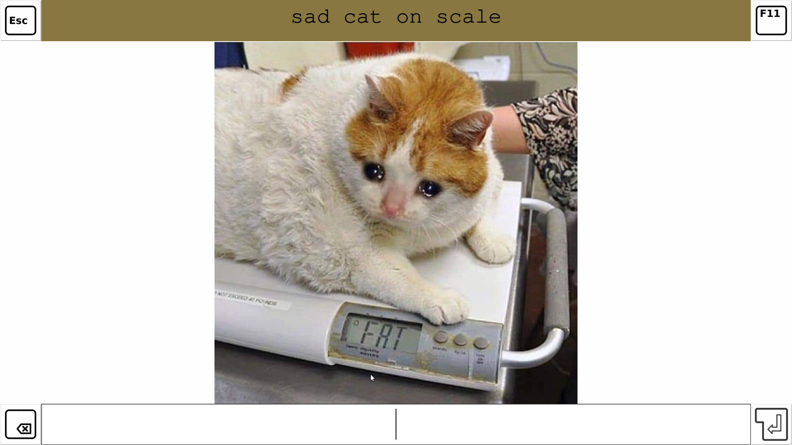

This project was originally located at [gitlab](https://gitlab.com/christianbrinkmann/image-rename-manual-gui). The project was originally only intended to rename images, but with the inclusion of animated gifs and then videos i decided that in theory this script should be able to rename all files. Because of this shift i've decided to redo the entire project and give it a new name, logo, purpose and repository.

# Crystal File Batch Renamer

The **Crystal** *file* **batch** *renamer*, or short just **crystalbatch**, is a simple *GUI* based program that allows a person to efficiently rename large batches of files manually.

## Table of contents

- [Crystal File Batch Renamer](#crystal-file-batch-renamer)
  - [Table of contents](#table-of-contents)
  - [Purpose](#purpose)
    - [Supported file types:](#supported-file-types)
  - [Requirements](#requirements)
    - [Gstreamer](#gstreamer)
    - [Python](#python)
  - [Execution](#execution)
    - [Examples](#examples)
  - [Usuage](#usuage)
    - [Key bindings](#key-bindings)
  - [How it looks like](#how-it-looks-like)

## Purpose

This simple script displays a GUI which shows an image or video at a time with it's current title at the top. It's designed to allow for quick and comfortable manual renaming of media files.

### Supported file types:

*this section is not complete yet*

## Requirements

This script requires python3 to run. I've successfully tested it on python 3.8.5 on ubuntu.

### Gstreamer

Since this software also supports videos installing gstreamer is required.

I've followed this guide to install gstreamer:

### Python

It is required to install Pillow.

## Execution

`python3 main.py <source_dir> <target_dir>`
`python3 main.py --source=<source_dir> --target=<target_dir>`

Using `--source=` and `--target=` allows for multiple source and target folders. The order of source and target folders defines its pairings: The first source_folders files are moved (after being renamed) into the first target folder and so on...

### Examples

`python3 main.py --source=source/image --source=source/video --target=target/image --target=target/video`

## Usuage

Start the main.py with the path of the source folder and the target folder. Then, for each shown media file, read the name shown at the top and decide if the name is acceptable for the image. The current filename is rated and the rating is displayed as the coloring of the background of the name (from red to green). You can decide to keep the current name (by pressing ENTER), to change the name (by entering a new name) or to delete the media file (by pressing DEL). Pausing gifs/videos is possible by using SPACE.

### Key bindings

| Key | Function |
| --- | ---------- |
| ESCAPE | Close the application. |
| F11 | Toggle fullscreen. |
| DELETE | Delete the current media file instead of moving it. |
| ENTER | Finish renaming the current media file.|
| SPACE | Pause/Resume/Restart video or gif playback. |

## How it looks like

1080p fullscreen screenshot:

Small window screenshot:

